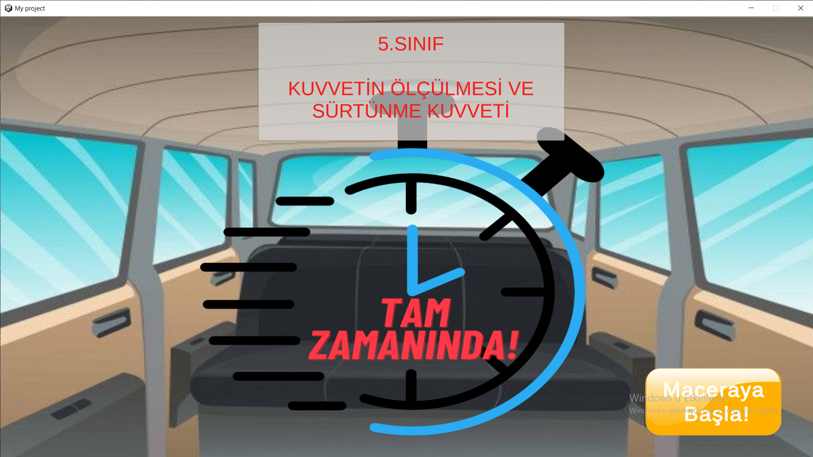
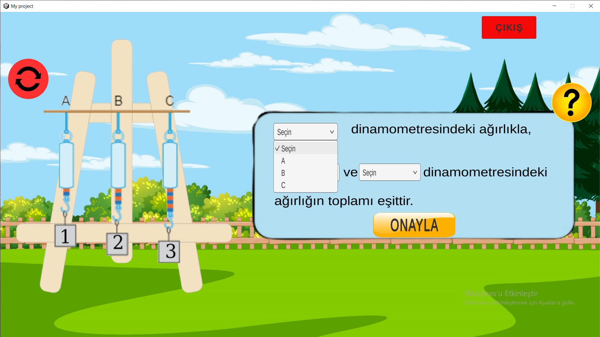
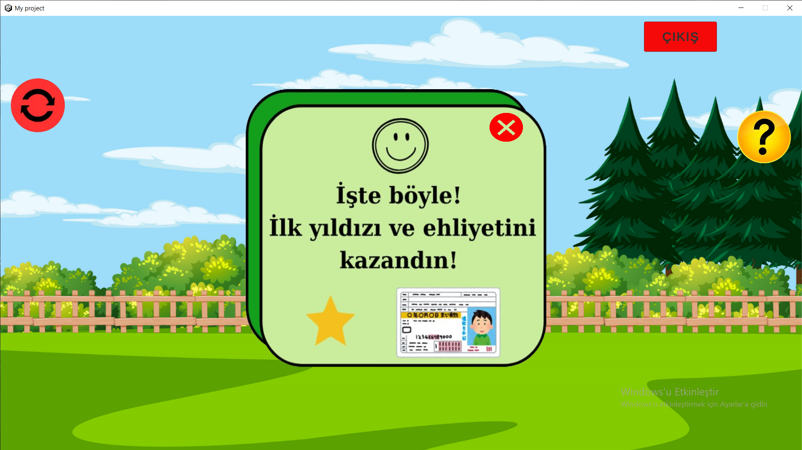
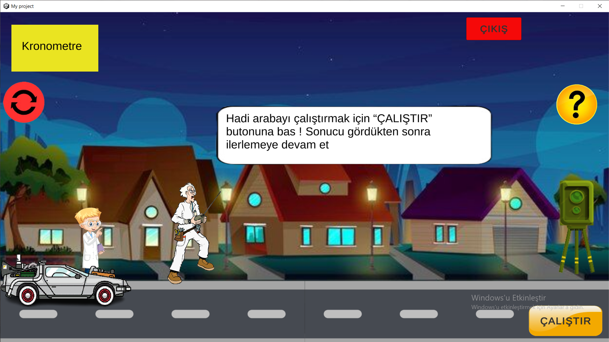
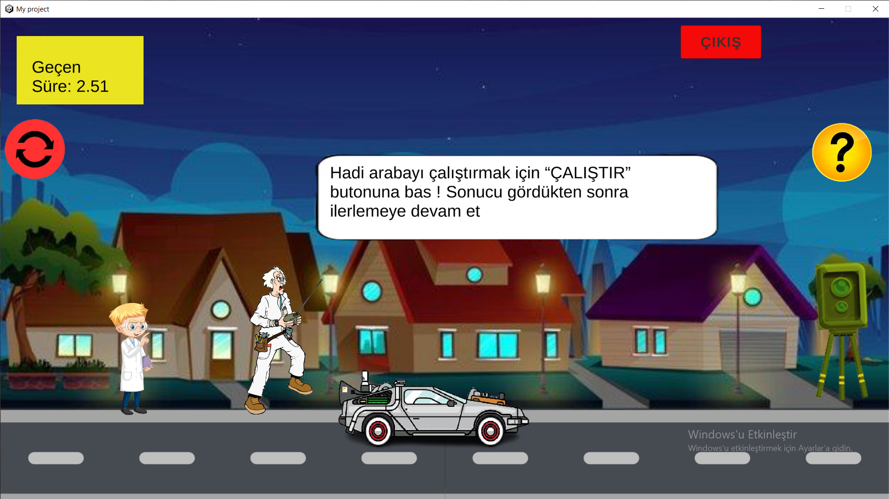
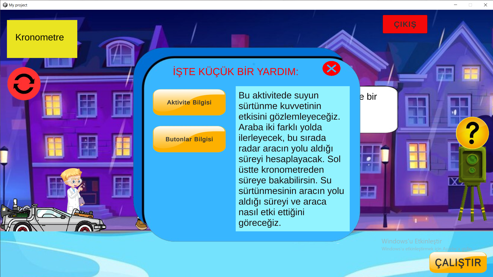
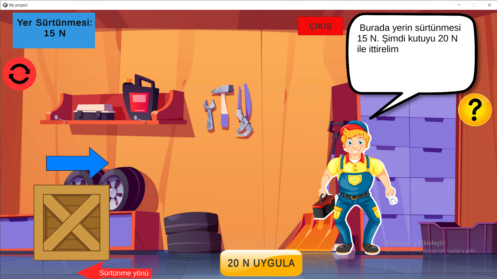
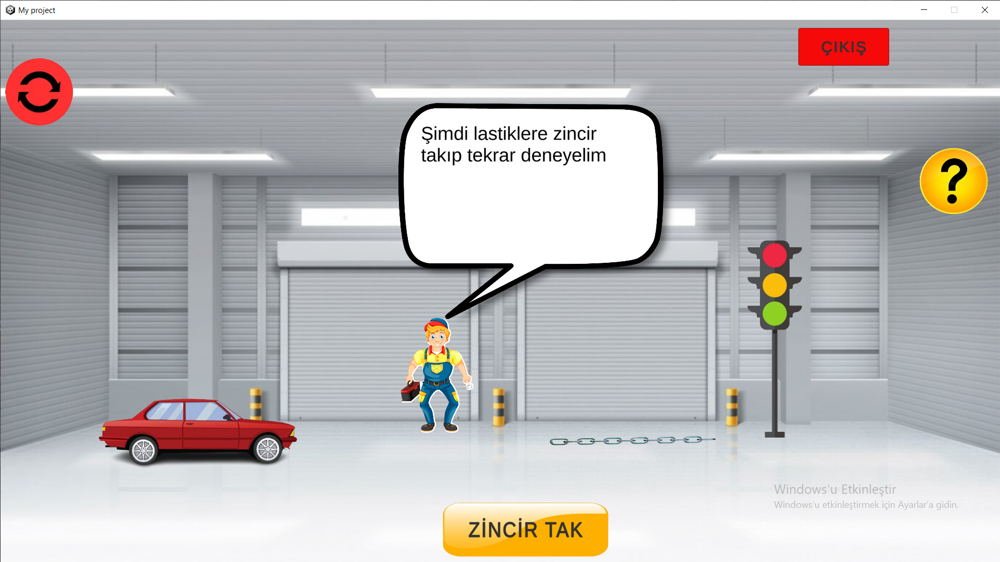

# 🚗 Just in Time / Tam Zamanında

**Just in Time** is a 2D educational game developed to help 5th grade students learn and reinforce physics concepts, specifically *force measurement* and *friction force*. The game combines interactive mechanics with visual and auditory feedback to create a fun and meaningful learning experience.

## 🎯 Purpose

This project was created as a school assignment to integrate game-based learning with science education. It aims to:

- Support students’ conceptual understanding of force and friction
- Provide active learning through game mechanics
- Increase engagement through animations, sound effects and immediate feedback

## 🛠️ Built With

- **Unity 2021**
- **C#**
- **Custom 2D Assets and Animations**
- **.exe Windows Build (Desktop only)**

## 🧩 Game Features

- 🎞️ **Animations** to visualize force and motion
- ✍️ **Fill-in-the-blanks** and **dropdown quizzes**
- 🎮 **Keyboard and mouse support**
- 🎵 **Realistic car sound effects**
- 🧭 **Interactive menu** for smooth navigation between sections
- ✅ **Feedback system** for correct/incorrect responses
- ⏪⏩ **Back and Next** buttons to freely move across activities

## 🎮 Controls

| Action | Input |
|--------|-------|
| Navigate menu | Mouse click |
| Select/Confirm | Mouse or keyboard |
| Interact with activities | Mouse |
| Move through steps | Keyboard arrows / Back & Next buttons |

## 📷 Screenshots

  
*Main scene*

  
*Dropdown quiz interface*

*Feedback mechanism*

*Dropdown quiz interface*

*Activity screen*

*Activity in moting with chronometer*

*Help screen design*

*Activty screen*

## 📁 Folder Structure (optional)

